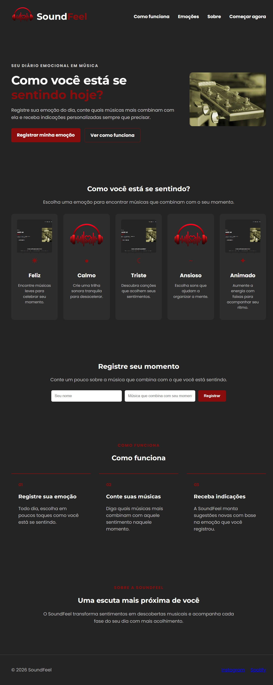
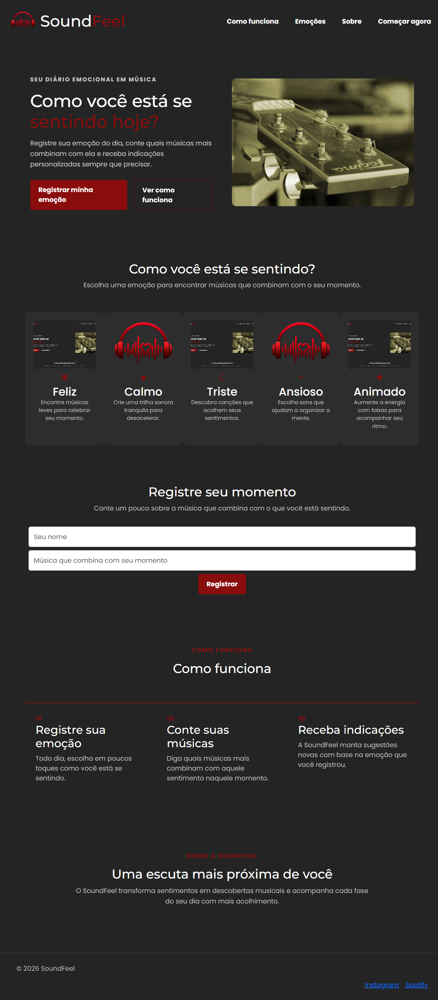
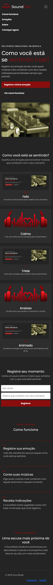

# SoundFeel

## Dados do projeto

- **Nome:** Hebert William de Souza
- **Matrícula:** 928034
- **Proposta:** Música e Emoções

## Descrição do projeto

O SoundFeel é uma home-page que conecta emoções e música. A proposta é ajudar o usuário a registrar como está se sentindo e descobrir faixas que combinam com seu humor e momento do dia.

## Tecnologias utilizadas

- HTML5 semântico
- Bootstrap 5 via CDN
- CSS3 para identidade visual
- Google Fonts

## Responsividade

A home-page utiliza o sistema responsivo do Bootstrap e se adapta a diferentes tamanhos de tela:

- **Desktop:** hero em duas colunas, cards de emoções organizados em cinco colunas e navegação horizontal.
- **Mobile:** conteúdo empilhado, cards em uma ou duas colunas, formulário vertical e menu recolhível.

## Wireframe do projeto

## Prints da versão responsiva com CSS puro

### Desktop

### Mobile

## Prints da versão responsiva com Bootstrap

### Desktop

### Mobile

## Página inicial

